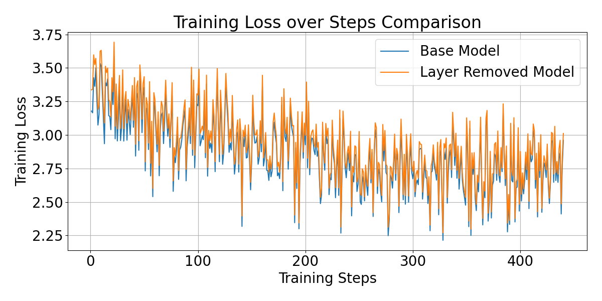

# Training small LLM on BMW Press Releases

This repository contains code and configurations for fine-tuningthe TinyLlama language model on a dataset of BMW press releases. The folder specifies a pipeline for data preprocessing, model training, and evaluation.

## Dataset and Dataset Prepraration

The raw dataset consists of BMW press release articles stored in a CSV file located at `data/raw/bmw_press_releases.csv`. Ech record in the CSV file contains:
- 'title': The title of the press release.
- 'date': The publication date of the press release as a string DD.MM.YYYY.
- 'url': The URL link to the original press release.
- 'summary': The summary of the press release.
- 'content': The full text of the press release.

The raw dataset is composed using a web scraping notebook located at `notebooks/scrape_press_releases.ipynb`. The script fetches press releases from the BMW press website and saves them into a structured CSV file. Specifically:
1. It takes an html page containing list of press releases as input ('notebooks/input/PressClub Global.html').
2. It extracts links to individual press release articles.
3. It visits each link, scrapes the relevant information (title, date, url, summary, content), and stores it in a structured format.
4. Finally, it saves the collected data into a CSV file for further processing.

## Processing Pipeline

The processing pipeline consists of three main stages:
1. Preprocessing: Transforming the raw CSV data into a cleaned and tokenized format suitable for model training, additionally splitting the dataset into training, validation, and test sets.
2. Training: Fine-tuning the TinyLlama model using the preprocessed dataset.
3. Evaluation: Assessing the performance of the fine-tuned model on the validation and test datasets.

### Configuration

The configuration for the pipeline is specified in configs/ folder.
- The data-related and preprocessing configurations are defined in `configs/data.yaml`, which includes paths to the raw and processed datasets, dataset split ratios, and tokenizer settings.
- Training hyperparameters are defined in `configs/training.yaml`.
- Model architecture and related settings are specified in `configs/model.yaml`.

## Models

The repository includes configurations for two base LLM models:
- TinyLlama/TinyLlama-1.1B-Chat-v1.0
- HuggingFaceTB/SmolLM2-135M

Additionally, the code implements two variants of LLM model:
- Base Model: The original TinyLlama or SmolLM2 model without any modifications.
- Layer-Removed Model: A modified version of the base model with one middle transformer block removed.

## Usage

### Environment
Create a virtual environment and install the required dependencies:
```bash
pip install -r requirements.txt
```

### Running the Pipeline

The pipeline is executed by first running the preprocessing script, followed by the training script, and finally the evaluation script. Each stage can be run independently using the provided scripts in the `scripts/` folder.

0. Run the scraping notebook to create the raw dataset:
1. Set the desired configurations in the `configs/` folder:
    - `data.yaml` for data paths and tokenisation settings. The tokenizer is set to use the one appropriate for the chosen base model.
    - `training.yaml` for training hyperparameters.
    - `model.yaml` for model architecture settings. (e.g., choosing between base and layer-removed models and the base LLM model).
2. Preprocess the data:
    ```bash
    python scripts/preprocess_data.py
    ```
    This will create processed dataset files in the `data/processed/` directory (according to data config), split into training, validation, and test sets.
3. Train the model:
    ```bash
    python scripts/train_model.py
    ```
    This will create an experiment output directory in the experiments folder, where model checkpoints and training logs will be saved.
4. Evaluate the model:
    ```bash
    python scripts/evaluate_model.py --experiment <experiment_name>
    ```
    The experiment name corresponds to the folder created in the experiments directory during training e.g. `exp_001_SmolLM2-135M_base`.
    Evaluation script has more options that can be explored using:
    ```bash
    python scripts/evaluate_model.py --help
    ```

### Design Considerations

#### Config Driven Development

The pipeline follows Config Driven Development principles, allowing easy adjustments of data paths, model configurations, and training hyperparameters through YAML configuration files.

For a single experiment, the data config and model config should be fixed so that the training script and evaluation can find the correct data files and model architecture.

The input configuration lives in the config folder only. When a training script is run, it creates an expriment folder in the experiments directory with a frozen config copy for reproducibility. Furthermore, each run of the training script creates a new experiment folder with a unique run id. There is no option to resume the training - it is left for future work.

#### Underlaying Libraries

The pipeline leverages the HuggingFace Transformers library for model loading, fine-tuning, and evaluation. The datasets library is used for efficient data handling and preprocessing. Training is managed using the Trainer API from the Transformers library, which simplifies the training loop and logging.


## Results

### Experiment setup

Sample experiments were conducted using the SmolLM2-135M base model and its layer-removed variant. Both models were fine-tuned on the BMW press releases dataset for a limited number of steps to demonstrate the pipeline functionality. 

#### Configuration 

Below are the key configurations used for the experiments:
```yaml
data:
  dataset:
    processed_dir: data/processed
    raw_csv: data/raw/bmw_press_releases.csv
  sequence:
    label_pad_token_id: -100
    max_length: 256
    packing: true
    pad_token_id: null
  splits:
    seed: 42
    test_ratio: 0.05
    train_ratio: 0.9
    validation_ratio: 0.05
  tokenizer:
    add_special_tokens: true
    use_fast: true
model:
  base_model: HuggingFaceTB/SmolLM2-135M
  variant: base # and layer_removed
training:
  batch_size: 1
  eval_steps: 20
  eval_strategy: steps
  fp16: true
  gradient_accumulation_steps: 4
  gradient_checkpointing: true
  learning_rate: 2e-5
  logging_steps: 1
  lr_scheduler: linear
  max_grad_norm: 1.0
  num_train_epochs: 2
  report_to: none
  save_steps: 10
  warmup_steps: 5
  weight_decay: 0.01
```

That is, the training consisted of 2 epochs with a batch size of 1, gradient accumulation over 4 steps, and a learning rate of 2e-5 (with decay and warmup). Mixed precision (fp16) and gradient checkpointing were enabled to optimize memory usage.

The training was deployed an a single A100 GPU with 80GB of VRAM.

### Results analysis notebook

The analysis of the training logs and evaluation results was conducted in the notebook `notebooks/compare_models_SmolLM2.ipynb`. Below are the findings from the experiments.

#### Evaluation Metrics


The evaluation metrics for both the base and layer-removed models are summarized in the table below:
| Model               | Eval Loss   | Perplexity |
|---------------------|-------------|------------|
| Base Model          | 2.7035      | 14.9325    |
| Layer Removed Model | 2.7527      | 15.6847    |
| Original Model      | 3.4234      | 30.6741    |

From the evaluation metrics, we can see that both the trained base and layer-removed models outperform the original pre-trained SmolLM2-135M model on the loss and the perplexity (exp(loss)) metrics. This indicates that the fine-tuning process has improved the model's ability to predict the next token in the sequence. Both trained models have similar performance, with the base model having a slightly lower loss and perplexity than the layer-removed model. This suggests that while removing a layer negatively impacts the model's performance.

#### Training Loss Comparison

The training loss curves for both the base and layer-removed models are plotted below. The base model shows a slightly lower loss throughout the training process compared to the layer-removed model, indicating better learning capacity.




The training loss curves for both the base and layer-removed models are plotted above. The loss for the base model is decaying slightly faster than for the layer-removed model, indicating better learning capacity. This aligns with the evaluation metrics, where the base model achieved a slightly lower loss and perplexity compared to the layer-removed model.

At the same time, we note that the training loss curves overlap significantly in relation to the noise of the loss curves, execmplifying that both models learned using the same training parameters and on the same sequential data distribution.

### Training Time Comparison

Below is the summary of the training times for both models:
| Model               | Training Time (seconds) | Steps per Second | Total FLOs |
|---------------------|-------------------------|------------------|------------|
| Base Model          | 322.05                  | 1.3660           | 2.87e+14   |
| Layer Removed Model | 311.35                  | 1.4130           | 2.77e+14   |

From the training logs, we observe that optimisation of the base model was operation at 1.366 steps/sec, while the layer-removed model trained at 1.413 steps/sec. This indicates that removing a layer did indeed speed up the training process, as expected, since there are fewer parameters to update during each training step.
In total, the training of the base model took 3% more time than the layer-removed model.


### Sample Generated Outputs

Below are sample outputs generated by both models given the same input prompt:

#### Sample 0:

**Input Prompt:**

Björn Lellmann, Head of Customer Racing at BMW M Motorsport:
“At the very top of my success list this week is

---

**True Continuation:** 
 not a race result –
  as impressive as they were. I am absolutely thrilled that starting
  from the 2026 season, we will have our own cup class for the BMW M2
  Racing in the NLS. This is exactly the kind of application we
  developed our new entry-level model for. It definitely belongs on the
  No

---
**Base Model Output:**
 the BMW M Hybrid EV3. I’m very happy with the performance and the performance of the BMW M Hybrid EV3. I’m very happy with the BMW M Hybrid EV3. I’m very happy with the BMW M Hybrid EV3. I’m very happy with the BMW M Hybrid EV3. I’m very happy with the BMW M Hybrid EV3. I’m very happy with the BMW 

---

**Layer Removed Model Output:**
 the BMW M Hybrid. I’m very happy with the BMW M Hybrid. It’s a very strong car, and I’m very happy with it. I’m very happy with the BMW M Hybrid. I’m very happy with the BMW M Hybrid. I’m very happy with the BMW M Hybrid. I’m very happy with the BMW M Hybrid. I’m very happy with the BMW M Hybrid. I

---
 
**Original Model Output:**

 the new BMW M 300e. It’s a 300-litre, 1.2-litre, 1.5-litre, 1.8-litre, 2.0-litre, 2.5-litre, 3.0-litre, 3.5-litre, 4.0-litre, 4.5-litre, 

 ---
 ---

 #### Sample 1:

**Input Prompt:**
 in this decisive stage of the season. I am
  delighted for each and every one of them and send my heartfelt
  congratulations. Now it’s about
  
---

**True Continuation:** 

 reaping the well-deserved rewards in
  the form of titles.”

NLS: BMW M2 Racing to get its own cup class in its debut season.
Right in its debut season in 2026, the BMW M2 Racing will conquer the
  "Green Hell". The new entry-level race car from BMW M
  Motorsport will receive its own cup class 
  
---
**Base Model Output:**
 the finale.

The finale of the season is the most important part of the
  season. It is the moment when the fans and the fans’ fans will
  decide whether the season is over or not. The finale of the season
  is the most important part of the season. It is the moment when
  the fans and the fans’ fa

---
**Layer Removed Model Output:**

 time to celebrate the season.

The 2025 season is now underway. The season is now
  determined. The season is now determined.

The season is now determined.

The season is now determined.

The season is now determined.

The season is now determined.

The season is now determined.

The season is now

---
**Original Model Output:**

 time to go to bed.

The next morning, I woke up to find the sun shining brightly in the
  window. I was so excited to see the beautiful blue sky and the
  brilliant orange and yellow flowers. I was so happy to see the
  beautiful flowers and the beautiful birds. I was so happy to see the
  beautifu

---
---
#### Sample 2:

**Input Prompt:***
 It is affordable, powerful,
  easy to maintain, and cost-efficient, with the typical M precision and
  drivability – ideal conditions for its own
  
---
**True Continuation:** 
 cup class on the
  Nordschleife." VLN Managing Director Mike Jäger added: "We
  are delighted that there will once again be a cup class for the BMW M2
  Racing in 2026. BMW cup cars have provided thrilling racing in the
  past. In 2016, 2017, 2019, and 2024, they produced the champions of
  our ser

---
**Base Model Output:**
 and other BMW M models.

The BMW M4 GT3 EVO is the latest model in the BMW M series.
It is the first of the new generation of the BMW M4 GT3 EVO.
The new model is based on the BMW M4 GT3 EVO, which is the first
  generation of the BMW M4 GT3 EVO.
The new model is also the first of the new generatio

---
**Layer Removed Model Output:**
 use.

The BMW M4 GT3 EVO is the first of its kind in the BMW Group’s
  range of electric vehicles. The BMW M4 GT3 EVO is the first of its
  kind in the BMW Group’s range of electric vehicles. The BMW M4 GT3 EVO
  is the first of its kind in the BMW Group’s range of electric vehicles.

The BMW M4 GT

---
**Original Model Output:**
 use.

The M-1000 is a 1000-horsepower, 10-cylinder, 2.5-liter, 1.5-inch-diameter, 1.5-inch-
wide, 1.5-inch-deep, 1.5-inch-wide, 1.5-inch-deep, 1.5-inch-wide, 1.5-

---
---

### Discussion of generated samples

From inspection of the generated samples, we observe that the trained base and trained layer-removed models do not produce perfect outputs. Both models stuck into repeating a certain sentence over and over again. Also, there is not much difference between the base and layer-removed models in terms of output quality.

At the same time, the trained models (base and layer-removed) produce outputs that are significantly better than the original pre-trained SmolLM2-135M model, which either stucks into repeatinng a similar two word phrase (Sample 0 or 2 - '*-litre'/'*-inch-wide') or generates completely irrelevant text (Sample 1 - text about flowers and blue sky). 

The fine-tuning process has clearly improved the model's ability to generate contextually relevant text, even if it is not perfect. For improving the output quality further, one needs more data and possibly longer training times. Furthermore, the original model is quite small (135M parameters), which limits its capacity to learn complex patterns in the data. Ideally, one would use a larger model e.g. 1.1B parameters or more.

### Conclusions and Future Work

The experiments demonstrate that fine-tuning a small language model like SmolLM2-135M on a specific domain dataset (BMW press releases) can significantly improve its performance in terms of loss, perplexity, and output relevance. Both the base and layer-removed models benefited from the fine-tuning process, with the base model showing slightly better performance. At the same time, removing a layer did speed up the training process, albeit with a minor drop in performance.

Notably, based on the parameters of the experiment (training time), size of the dataset and the size of the model, both models still exhibited limitations in generating high-quality text, often falling into repetitive patterns. As shown, this could be attributed to the original model size which failed to produce good continuations. Thus, even with more fine-tuning and data, the small model size may cap the potential quality of generated text.

There are several avenues for future work which fall into two main categories:
1. Task-specific Improvements for Application:
   - Specification of the specific BMW-related tasks (e.g., Q&A, summarization) and tailoring the training process accordingly, i.e. using task-specific datasets, evaluations metrics, appriopriate base models and training time. For example, for Q&A tasks, one could create an extended BMW news Q&A dataset, use Q&A-oriented base LLM models, and evaluate using accuracy or F1-score metrics.
2. Research-oriented modifications for further understanding of model trade-offs:
   - Experimenting with larger base models (e.g., TinyLlama-1.1B) to assess the impact of model size on output quality.
   - Exploring different model modifications (e.g., removing multiple layers, varying the index of the removed layer) to better understand the trade-offs between model size, training speed, and output quality.
